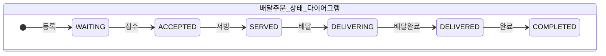
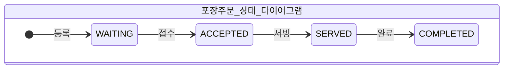

# 키친포스

## 퀵 스타트

```sh
cd docker
docker compose -p kitchenpos up -d
```

## 요구 사항

### 상품

- 상품을 등록할 수 있다.
- 상품의 가격이 올바르지 않으면 등록할 수 없다.
    - 상품의 가격은 0원 이상이어야 한다.
- 상품의 이름이 올바르지 않으면 등록할 수 없다.
    - 상품의 이름에는 비속어가 포함될 수 없다.
- 상품의 가격을 변경할 수 있다.
- 상품의 가격이 올바르지 않으면 변경할 수 없다.
    - 상품의 가격은 0원 이상이어야 한다.
- 상품의 가격이 변경될 때 메뉴의 가격이 메뉴에 속한 상품 금액의 합보다 크면 메뉴가 숨겨진다.
- 상품의 목록을 조회할 수 있다.

### 메뉴 그룹

- 메뉴 그룹을 등록할 수 있다.
- 메뉴 그룹의 이름이 올바르지 않으면 등록할 수 없다.
    - 메뉴 그룹의 이름은 비워 둘 수 없다.
- 메뉴 그룹의 목록을 조회할 수 있다.

### 메뉴

- 1 개 이상의 등록된 상품으로 메뉴를 등록할 수 있다.
- 상품이 없으면 등록할 수 없다.
- 메뉴에 속한 상품의 수량은 0 이상이어야 한다.
- 메뉴의 가격이 올바르지 않으면 등록할 수 없다.
    - 메뉴의 가격은 0원 이상이어야 한다.
- 메뉴에 속한 상품 금액의 합은 메뉴의 가격보다 크거나 같아야 한다.
- 메뉴는 특정 메뉴 그룹에 속해야 한다.
- 메뉴의 이름이 올바르지 않으면 등록할 수 없다.
    - 메뉴의 이름에는 비속어가 포함될 수 없다.
- 메뉴의 가격을 변경할 수 있다.
- 메뉴의 가격이 올바르지 않으면 변경할 수 없다.
    - 메뉴의 가격은 0원 이상이어야 한다.
- 메뉴에 속한 상품 금액의 합은 메뉴의 가격보다 크거나 같아야 한다.
- 메뉴를 노출할 수 있다.
- 메뉴의 가격이 메뉴에 속한 상품 금액의 합보다 높을 경우 메뉴를 노출할 수 없다.
- 메뉴를 숨길 수 있다.
- 메뉴의 목록을 조회할 수 있다.

### 주문 테이블

- 주문 테이블을 등록할 수 있다.
- 주문 테이블의 이름이 올바르지 않으면 등록할 수 없다.
    - 주문 테이블의 이름은 비워 둘 수 없다.
- 빈 테이블을 해지할 수 있다.
- 빈 테이블로 설정할 수 있다.
- 완료되지 않은 주문이 있는 주문 테이블은 빈 테이블로 설정할 수 없다.
- 방문한 손님 수를 변경할 수 있다.
- 방문한 손님 수가 올바르지 않으면 변경할 수 없다.
    - 방문한 손님 수는 0 이상이어야 한다.
- 빈 테이블은 방문한 손님 수를 변경할 수 없다.
- 주문 테이블의 목록을 조회할 수 있다.

### 주문

- 1개 이상의 등록된 메뉴로 배달 주문을 등록할 수 있다.
- 1개 이상의 등록된 메뉴로 포장 주문을 등록할 수 있다.
- 1개 이상의 등록된 메뉴로 매장 주문을 등록할 수 있다.
- 주문 유형이 올바르지 않으면 등록할 수 없다.
- 메뉴가 없으면 등록할 수 없다.
- 매장 주문은 주문 항목의 수량이 0 미만일 수 있다.
- 매장 주문을 제외한 주문의 경우 주문 항목의 수량은 0 이상이어야 한다.
- 배달 주소가 올바르지 않으면 배달 주문을 등록할 수 없다.
    - 배달 주소는 비워 둘 수 없다.
- 빈 테이블에는 매장 주문을 등록할 수 없다.
- 숨겨진 메뉴는 주문할 수 없다.
- 주문한 메뉴의 가격은 실제 메뉴 가격과 일치해야 한다.
- 주문을 접수한다.
- 접수 대기 중인 주문만 접수할 수 있다.
- 배달 주문을 접수되면 배달 대행사를 호출한다.
- 주문을 서빙한다.
- 접수된 주문만 서빙할 수 있다.
- 주문을 배달한다.
- 배달 주문만 배달할 수 있다.
- 서빙된 주문만 배달할 수 있다.
- 주문을 배달 완료한다.
- 배달 중인 주문만 배달 완료할 수 있다.
- 주문을 완료한다.
- 배달 주문의 경우 배달 완료된 주문만 완료할 수 있다.
- 포장 및 매장 주문의 경우 서빙된 주문만 완료할 수 있다.
- 주문 테이블의 모든 매장 주문이 완료되면 빈 테이블로 설정한다.
- 완료되지 않은 매장 주문이 있는 주문 테이블은 빈 테이블로 설정하지 않는다.
- 주문 목록을 조회할 수 있다.

## 용어 사전

### 공통 용어
| 한글명    | 영문명     | 설명                                 |
|--------|---------|------------------------------------|
| 등록     | create  | 메뉴나 상품 등의 지정한 정보를 저장소에 저장하는 것을 말한다 |
| 비속어    | profanity | 사용하기에 부적합한 욕설과 같은 단어들을 말한다         |


## 모델링

### 상품 (Product)

| 한글명   | 영문명           | 설명                                    |
|-------|---------------|---------------------------------------|
| 상품     | product       | 메뉴를 구성하는 제품. 후라이드 치킨이나 음료와 같은 품목을 말한다 |
| 상품 이름 | name  | 상품을 부르는 명칭                            |
| 상품 가격 | price | 상품을 구매하기 위해 지불해야 할 가격                 |

- ```상품```은 비속어가 포함되지 않은 ```이름``` 속성을 가진다
- ```상품```은 0원 이상의 ```가격``` 속성을 가진다

#### 기능
- ```상품```을 ```등록```할 수 있다
- ```상품```의 ```가격```을 변경할 수 있다
  - ```메뉴```의 가격이 ```메뉴 상품```의 ```가격```의 합보다 클 경우 ```메뉴```를 숨긴다
- ```상품```의 목록을 조회할 수 있다

### 메뉴 (Menu)

| 한글명   | 영문명          | 설명                             |
|-------|--------------|--------------------------------|
| 메뉴    | menu         | 1개 이상의 메뉴 상품으로 구성된 주문의 단위      |
| 메뉴 이름 | name         | 메뉴를 부르는 명칭                     |
| 메뉴 가격 | price        | 메뉴를 구매하기 위해 지불해야 할 가격          |
| 노출 여부 | displayed    | 메뉴가 식당에서 보이거나 숨겨진 상태를 표현한다     | 
| 메뉴 노출 | display      | 손님이 주문할 수 있게 식당에서 메뉴가 보이는 상태   |
| 메뉴 숨김 | hide         | 손님이 주문할 수 없게 식당에서 메뉴가 숨겨진 상태   |
| 메뉴 상품 | menu product | 메뉴를 구성하는 상품과 그 상품의 갯수를 표현하는 단위 |

- ```메뉴```는 비속어가 포함되지 않은 ```이름``` 속성을 가진다
- ```메뉴```는 0원 이상의 ```가격``` 속성을 가진다
- ```메뉴```는 ```노출 여부``` 속성을 가진다
- ```메뉴```는 ```메뉴 그룹```에 속한다
  - ```메뉴 그룹```과 ```메뉴```는 1:N 관계이다
- ```메뉴```는 1개 이상의 ```메뉴 상품``` 목록 속성을 가진다
  - ```메뉴 상품```의 ```갯수```는 0개 이상이어야 한다
  - ```메뉴 상품```의 ```상품```은 ```등록```된 ```상품```이어야 한다

#### 기능
- ```메뉴```를 ```등록```할 수 있다
  - ```메뉴 상품```의 ```가격```의 합은 ```메뉴```의 ```가격``` 보다 크거나 같아야 한다
- ```메뉴```의 ```가격```을 변경할 수 있다
  - ```메뉴 상품```의 ```가격```의 합은 ```메뉴```의 ```가격``` 보다 크거나 같아야 한다
- ```메뉴```를 ```노출```할 수 있다
  - ```메뉴 상품```의 ```가격```의 합은 ```메뉴```의 ```가격``` 보다 크거나 같아야 한다
- ```메뉴```를 ```숨김```처리할 수 있다
- ```메뉴```의 목록을 조회할 수 있다

### 메뉴 그룹 (Menu Group)

| 한글명      | 영문명        | 설명              |
|----------|------------|-----------------|
| 메뉴 그룹    | menu group | 메뉴를 구분할 수 있는 집합 |
| 메뉴 그룹 이름 | name       | 메뉴 그룹을 부르는 명칭   |

- ```메뉴 그룹```은 비어있지 않은 ```이름``` 속성을 가진다

#### 기능
- ```메뉴 그룹```을 ```등록```할 수 있다
- ```메뉴 그룹```의 목록을 조회할 수 있다

### 주문 테이블 (Order Table)

| 한글명       | 영문명              | 설명                                  |
|-----------|------------------|-------------------------------------|
| 주문 테이블    | order table      | 식당에서 주문을 받기 위해 사용하는 테이블             |
| 주문 테이블 이름 | name             | 주문 테이블을 부르는 명칭                      |
| 점유 여부     | occupancy        | 테이블의 점유 상태를 말하며 점유/비점유의 두 가지 상태를 가진다 |
| 점유        | occupied         | 주문 테이블을 차지한 상태                      |
| 비점유       | unoccupied       | 주문 테이블을 차지하지 않은 상태                  |
| 착석        | sit              | 비점유 테이블을 점유하는 것을 말한다                |
| 정리        | clear            | 점유한 테이블을 정리하여 비점유 상태로 만드는 것을 말한다    |
| 손님 수      | number of guests | 테이블에 착석한 손님 수                       |

- ```주문 테이블```은 비어있지 않은 ```이름``` 속성을 가진다
- ```주문 테이블```은 0 이상의 ```손님 수``` 속성을 가진다
- ```주문 테이블```은 ```점유``` 속성을 가진다

#### 기능
- ```주문 테이블```을 ```등록```할 수 있다
  - ```점유 여부```는 ```비점유``` 상태이다
  - ```손님 수```는 0이다
- ```주문 테이블```에 ```착석```할 수 있다
- ```주문 테이블```을 ```정리```할 수 있다
  - ```주문 테이블```의 ```주문```은 완료되어야 한다 
  - ```손님 수```를 0으로 변경한다
- ```손님 수```를 변경할 수 있다
  - ```주문 테이블```은 ```점유``` 상태여야 한다
- ```주문 테이블```의 목록을 조회할 수 있다

### 주문 (Order)

| 한글명    | 영문명              | 설명                                                                                    |
|--------|------------------|---------------------------------------------------------------------------------------|
| 주문     | order            | 손님이 식당에서 구매한 메뉴들 또는 메뉴들을 구매하는 행위를 말한다                                                 |
| 배달 주소  | delivery address | 배달 주문이 배달되어야 할 손님의 주소                                                                 |
| 배달 대행사 | delivery agency  | 배달 라이더를 관리하고 파견해주는 회사                                                                 |
| 배달 라이더 | rider            | 배달 주문을 배달 주소로 전달해주는 사람                                                                |
| 주문 시간  | order date time  | 손님이 식당에 주문한 시간                                                                        |
| 주문 항목  | order line item  | 주문을 구성하는 메뉴와 그 메뉴의 갯수를 표현하는 단위                                                        |
| 주문 유형  | order type       | 손님의 주문을 어떻게 제공할지를 말하며 ```매장 주문```, ```포장 주문```, ```매장 주문```으로 구분된다                    |
| 배달 주문  | DELIVERY         | 손님이 주문한 메뉴들을 배달을 통해 전달해야 하는 주문 유형                                                     |
| 포장 주문  | TAKEOUT          | 손님이 주문한 포장된 메뉴들을 직접 가게에서 수령하는 주문 유형                                                   |
| 매장 주문  | EAT_IN           | 손님이 주문 테이블에서 직접 식사하는 주문 유형                                                            |
| 주문 상태  | order status     | 주문의 진행 상황을 말하며 ```접수 대기```, ```접수```, ```서빙```, ```배달```, ```배달 완료```, ```완료```로 구분된다 |
| 접수 대기  | WAITING          | 손님이 가게에 주문을 요청하여 접수되지 않은 상태                                                           |
| 접수     | ACCEPTED         | 손님의 주문을 식당에서 확인하여 확정된 상태                                                              |
| 서빙     | SERVED           | 손님의 주문이 완성되어 나온 상태                                                                    |
| 배달     | DELIVERING       | 서빙된 주문이 배달 라이더를 통해 배달중인 상태                                                            |
| 배달 완료  | DELIVERED        | 배달중이었던 주문이 배달이 완료되어 배달 주소로 전달된 상태                                                     |
| 완료     | COMPLETED        | 주문이 최종적으로 손님에게 전달된 상태                                                                 |

- ```주문```은 ```주문 유형``` 속성을 가진다
  - ```주문```은 공통의 속성 이외에 ```주문 유형```마다 독립적인 속성을 가진다
- ```주문```은 ```주문 상태``` 속성을 가진다
  - ```주문 상태```는 ```주문 유형```마다 가능한 상태가 구분된다
- ```주문```은 ```주문 시간``` 속성을 가진다
- ```주문```은 1개 이상의 ```주문 항목``` 속성을 가진다
  - ```주문 항목```의 ```메뉴```는 ```등록```된 ```메뉴```여야 한다

#### 기능
- ```주문```의 목록을 조회할 수 있다

### 주문 - 배달 주문 (Delivery Order)
- ```배달 주문```은 ```주문 유형```이 ```배달 주문```인 ```주문```이다
- ```배달 주문```은 비어있지 않은 ```배달 주소``` 속성을 가진다
- ```배달 주문```의 ```주문 항목```은 모두 ```수량```이 0 이상이어야 한다
- ```배달 주문```은 한정된 ```주문 상태``` 속성을 가진다
  - ```접수 대기```, ```접수```, ```서빙```, ```배달```, ```배달 완료```, ```완료``` 속성을 가진다

#### 기능
- ```배달 주문```을 ```등록```할 수 있다
  - ```주문 항목```의 ```메뉴```는 ```노출```된 ```메뉴```여야 한다
  - ```주문 항목```의 ```가격```은 ```메뉴```의 ```가격```과 일치해야 한다
  - ```주문 상태```는 ```접수 대기``` 상태이다
- ```배달 주문```을 ```접수```할 수 있다
  - ```주문 상태```는 ```접수 대기``` 상태여야 한다
  - ```배달 대행사```를 통해 ```배달 라이더```를 호출한다
- ```배달 주문```을 ```서빙```할 수 있다
  - ```주문 상태```는 ```접수``` 상태여야 한다
- ```배달 주문```을 ```배달```할 수 있다
  - ```주문 상태```는 ```서빙``` 상태여야 한다
- ```배달 주문```을 ```배달 완료```할 수 있다
  - ```주문 상태```는 ```배달``` 상태여야 한다
- ```배달 주문```을 ```완료```할 수 있다
  - ```주문 상태```는 ```배달 완료``` 상태여야 한다



### 주문 - 포장 주문 (Takeout Order)
- ```포장 주문```은 ```주문 유형```이 ```포장 주문```인 ```주문```이다
- ```포장 주문```의 ```주문 항목```은 모두 ```수량```이 0 이상이어야 한다
- ```포장 주문```은 한정된 ```주문 상태``` 속성을 가진다
  - ```접수 대기```, ```접수```, ```서빙```, ```완료``` 속성을 가진다

#### 기능
- ```포장 주문```을 ```등록```할 수 있다
  - ```주문 항목```의 ```메뉴```는 ```노출```된 ```메뉴```여야 한다
  - ```주문 항목```의 ```가격```은 ```메뉴```의 ```가격```과 일치해야 한다
  - ```주문 상태```는 ```접수 대기``` 상태이다
- ```포장 주문```을 ```접수```할 수 있다
  - ```주문 상태```는 ```접수 대기``` 상태여야 한다
- ```포장 주문```을 ```서빙```할 수 있다
  - ```주문 상태```는 ```접수``` 상태여야 한다
- ```포장 주문```을 ```완료```할 수 있다
  - ```주문 상태```는 ```서빙``` 상태여야 한다



### 주문 - 매장 주문 (Eat In Order)
- ```매장 주문```은 ```주문 유형```이 ```매장 주문```인 ```주문```이다
- ```매장 주문```은 ```주문 테이블``` 속성을 가진다
- ```매장 주문```은 한정된 ```주문 상태``` 속성을 가진다
  - ```접수 대기```, ```접수```, ```서빙```, ```완료``` 속성을 가진다

#### 기능
- ```매장 주문```을 ```등록```할 수 있다
  - ```주문 항목```의 ```메뉴```는 ```노출```된 ```메뉴```여야 한다
  - ```주문 항목```의 ```가격```은 ```메뉴```의 ```가격```과 일치해야 한다
  - ```주문 테이블```의 ```점유 여부```가 ```점유```여야 한다
  - ```주문 상태```는 ```접수 대기``` 상태이다
- ```매장 주문```을 ```접수```할 수 있다
  - ```주문 상태```는 ```접수 대기``` 상태여야 한다
- ```매장 주문```을 ```서빙```할 수 있다
  - ```주문 상태```는 ```접수``` 상태여야 한다
- ```매장 주문```을 ```완료```할 수 있다
  - ```주문 상태```는 ```서빙``` 상태여야 한다
  - ```주문 테이블```의 ```주문```이 모두 ```완료```되었다면 ```주문 테이블```을 ```정리```한다


