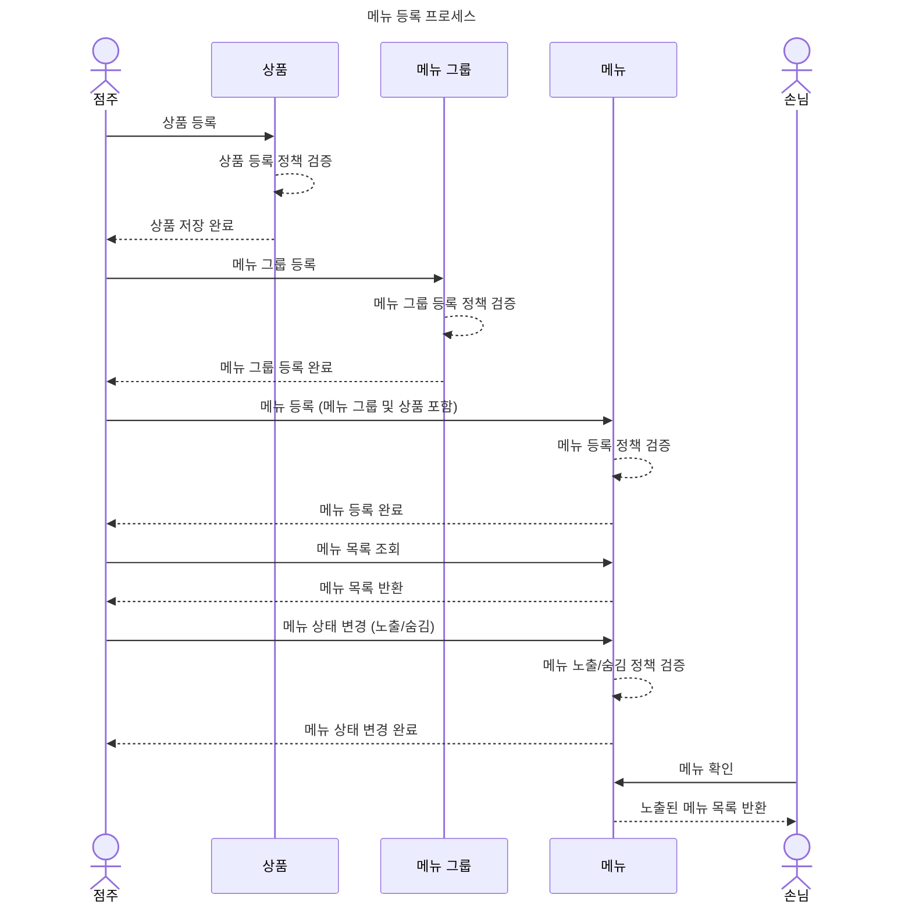
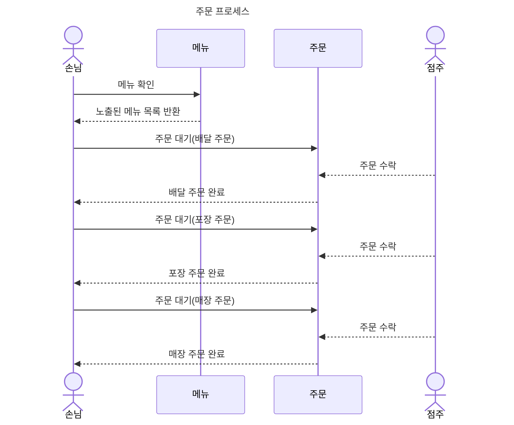
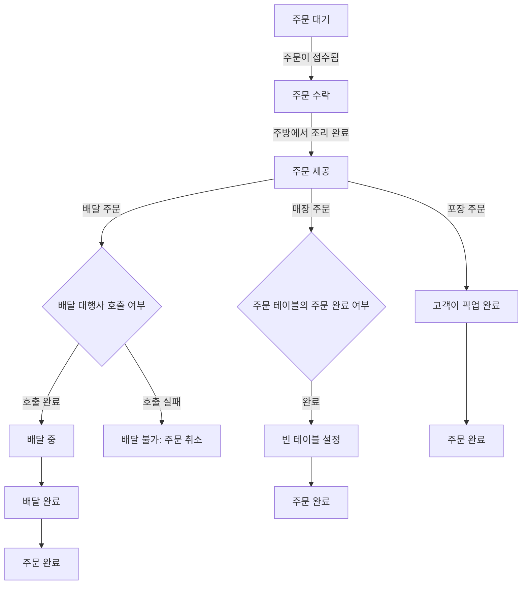
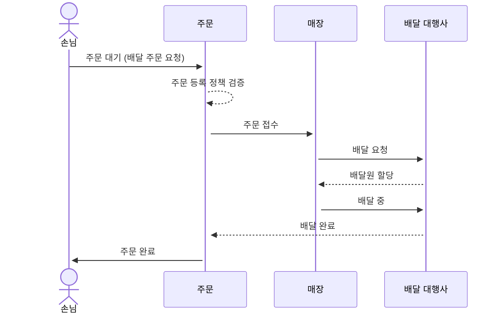
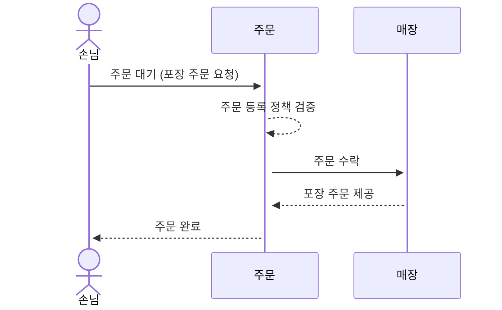
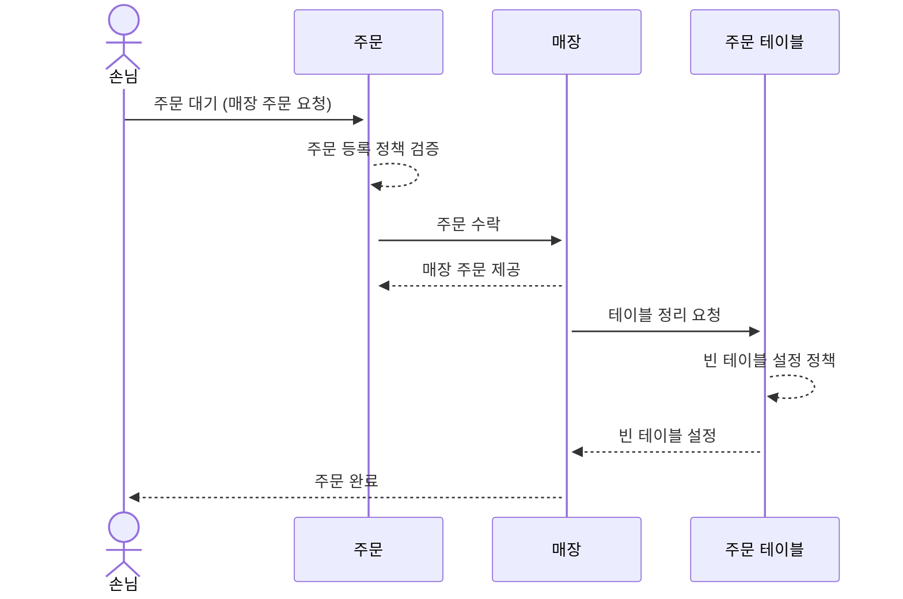

# 키친포스

## 퀵 스타트

```sh
cd docker
docker compose -p kitchenpos up -d
```

## 요구 사항

### 상품

- 상품을 등록할 수 있다.
- 상품의 가격이 올바르지 않으면 등록할 수 없다.
    - 상품의 가격은 0원 이상이어야 한다.
- 상품의 이름이 올바르지 않으면 등록할 수 없다.
    - 상품의 이름에는 비속어가 포함될 수 없다.
- 상품의 가격을 변경할 수 있다.
- 상품의 가격이 올바르지 않으면 변경할 수 없다.
    - 상품의 가격은 0원 이상이어야 한다.
- 상품의 가격이 변경될 때 메뉴의 가격이 메뉴에 속한 상품 금액의 합보다 크면 메뉴가 숨겨진다.
- 상품의 목록을 조회할 수 있다.

### 메뉴 그룹

- 메뉴 그룹을 등록할 수 있다.
- 메뉴 그룹의 이름이 올바르지 않으면 등록할 수 없다.
    - 메뉴 그룹의 이름은 비워 둘 수 없다.
- 메뉴 그룹의 목록을 조회할 수 있다.

### 메뉴

- 1 개 이상의 등록된 상품으로 메뉴를 등록할 수 있다.
- 상품이 없으면 등록할 수 없다.
- 메뉴에 속한 상품의 수량은 0 이상이어야 한다.
- 메뉴의 가격이 올바르지 않으면 등록할 수 없다.
    - 메뉴의 가격은 0원 이상이어야 한다.
- 메뉴에 속한 상품 금액의 합은 메뉴의 가격보다 크거나 같아야 한다.
- 메뉴는 특정 메뉴 그룹에 속해야 한다.
- 메뉴의 이름이 올바르지 않으면 등록할 수 없다.
    - 메뉴의 이름에는 비속어가 포함될 수 없다.
- 메뉴의 가격을 변경할 수 있다.
- 메뉴의 가격이 올바르지 않으면 변경할 수 없다.
    - 메뉴의 가격은 0원 이상이어야 한다.
- 메뉴에 속한 상품 금액의 합은 메뉴의 가격보다 크거나 같아야 한다.
- 메뉴를 노출할 수 있다.
- 메뉴의 가격이 메뉴에 속한 상품 금액의 합보다 높을 경우 메뉴를 노출할 수 없다.
- 메뉴를 숨길 수 있다.
- 메뉴의 목록을 조회할 수 있다.

### 주문 테이블

- 주문 테이블을 등록할 수 있다.
- 주문 테이블의 이름이 올바르지 않으면 등록할 수 없다.
    - 주문 테이블의 이름은 비워 둘 수 없다.
- 빈 테이블을 해지할 수 있다.
- 빈 테이블로 설정할 수 있다.
- 완료되지 않은 주문이 있는 주문 테이블은 빈 테이블로 설정할 수 없다.
- 방문한 손님 수를 변경할 수 있다.
- 방문한 손님 수가 올바르지 않으면 변경할 수 없다.
    - 방문한 손님 수는 0 이상이어야 한다.
- 빈 테이블은 방문한 손님 수를 변경할 수 없다.
- 주문 테이블의 목록을 조회할 수 있다.

### 주문

- 1개 이상의 등록된 메뉴로 배달 주문을 등록할 수 있다.
- 1개 이상의 등록된 메뉴로 포장 주문을 등록할 수 있다.
- 1개 이상의 등록된 메뉴로 매장 주문을 등록할 수 있다.
- 주문 유형이 올바르지 않으면 등록할 수 없다.
- 메뉴가 없으면 등록할 수 없다.
- 매장 주문은 주문 항목의 수량이 0 미만일 수 있다.
- 매장 주문을 제외한 주문의 경우 주문 항목의 수량은 0 이상이어야 한다.
- 배달 주소가 올바르지 않으면 배달 주문을 등록할 수 없다.
    - 배달 주소는 비워 둘 수 없다.
- 빈 테이블에는 매장 주문을 등록할 수 없다.
- 숨겨진 메뉴는 주문할 수 없다.
- 주문한 메뉴의 가격은 실제 메뉴 가격과 일치해야 한다.
- 주문을 접수한다.
- 접수 대기 중인 주문만 접수할 수 있다.
- 배달 주문을 접수되면 배달 대행사를 호출한다.
- 주문을 서빙한다.
- 접수된 주문만 서빙할 수 있다.
- 주문을 배달한다.
- 배달 주문만 배달할 수 있다.
- 서빙된 주문만 배달할 수 있다.
- 주문을 배달 완료한다.
- 배달 중인 주문만 배달 완료할 수 있다.
- 주문을 완료한다.
- 배달 주문의 경우 배달 완료된 주문만 완료할 수 있다.
- 포장 및 매장 주문의 경우 서빙된 주문만 완료할 수 있다.
- 주문 테이블의 모든 매장 주문이 완료되면 빈 테이블로 설정한다.
- 완료되지 않은 매장 주문이 있는 주문 테이블은 빈 테이블로 설정하지 않는다.
- 주문 목록을 조회할 수 있다.

---

## 용어 사전

**[1]**: 유효성 검사와 관련된 필수조건도 명시를 하는게 좋을까?
<br>
**[2]**: 행위(CRUD)에 대해서도 용어사전으로 정리를 하는 것이 좋을까?

### 상품 (product)

한글 명     | 영문 명                 | 설명                           
----------|----------------------|------------------------------
| 상품  | product       | `메뉴`를 구성할 수 있는 `판매할 수 있는 상품` |
| 상품 가격 | product price | `상품`의 판매 가격 (0원 이상) [1]      |
| 상품명 | product name  | `상품`의 이름 (비속어 포함 불가) [1]     |
| 상품 목록 | product list  | 등록된 `상품`들의 전체 목록             |
| 상품 등록  | create product       | 새로운 `상품`을 등록하는 기능 [2]        |
| 상품 가격 변경 | change product price | 기존 `상품`의 가격을 수정하는 기능 [2]     |
| 상품 목록 조회 | find product list      | 등록된 `상품` 목록을 조회하는 기능 [2]     |

### 메뉴그룹 (menu group)

| 한글명         | 영문명             | 설명                    |
|-------------|-----------------|-----------------------------|
| 메뉴 그룹       | menu group      | 특정 카테고리에 속하는 `메뉴`들의 `상위 집단` |
| 메뉴 그룹명     | menu group name | `메뉴 그룹`의 이름           |
| 메뉴 그룹 목록    | menu group list | 등록된 `메뉴 그룹`들의 전체 목록   |
| 메뉴 그룹 목록 조회 | find menu group list | 등록된 `메뉴 그룹` 목록을 조회하는 기능 [2] |
| 메뉴 그룹 등록  | create menu group    | 새로운 `메뉴 그룹`을 등록하는 기능 [2]    |

### 메뉴 (menu)

| 한글명   | 영문명               | 설명                       |
|-------|-------------------|--------------------------|
| 메뉴    | menu              | `한 개의 상품`이상으로 구성된 주문 가능한 항목 |
| 메뉴 상품 | menu proudct      | `메뉴`에 포함된 개별 상품          |
| 메뉴 가격 | menu price        | `메뉴`의 판매 가격 (0원 이상)      |
| 메뉴명   | menu name         | `메뉴`의 이름 (비속어 포함 불가) |
| 메뉴 목록 | menu list         | 등록된 `메뉴`들의 전체 목록         |
| 메뉴 등록    | create menu       | 새로운 `메뉴`를 등록하는 기능 [2]    |
| 메뉴 목록 조회 | find menu list    | 등록된 `메뉴` 목록을 조회하는 기능 [2] |
| 메뉴 가격 변경 | change menu price | 기존 `메뉴`의 가격을 수정하는 기능 [2] |
| 메뉴 노출 | display menu      | 고객이 `주문할 수 있는 전시된` 상태  |
| 메뉴 숨김 | hide menu         | 고객이 `주문할 수 없는 전시종료된` 상태  |

### 주문 테이블 (order table)

| 한글명          | 영문명                     | 설명                                    |
|--------------|-------------------------|---------------------------------------|
| 주문 테이블       | order table             | 매장의 `주문이 가능한 테이블`                     |
| 주문 테이블명      | order table name        | `주문 테이블`의 이름 (비워 둘 수 없음)              |
| 방문 손님 수      | number of guests        | `주문 테이블`에 착석한 손님의 인원 수 (0명 이상)        |
| 주문 테이블 목록    | order table list        | 등록된 `주문 테이블`들의 전체 목록 [2]              |
| 주문 테이블 등록    | create order table      | 새로운 `주문 테이블`을 등록하는 기능 [2]             |
| 빈 테이블        | empty table             | 매장의 테이블을 정리하고 `착석한 손님이 없는 테이블`        |
| 빈 테이블 해지     | sit empty table         | 빈 `테이블`을 해지하는 기능 (손님이 테이블에 앉은 상태) [2] |
| 빈 테이블 설정     | clear empty table       | 빈 `테이블`로 설정하는 기능 (손님이 테이블에 없는 상태) [2] |
| 방문 손님 수 변경   | change number of guests | `주문 테이`블의 방문한 손님 수를 수정하는 기능 [2]       |
| 주문 테이블 목록 조회 | find order table list   | 등록된 `주문 테이블` 목록을 조회하는 기능 [2]          |

### 주문 (orders)

| 한글명       | 영문명                  | 설명                                |
|-----------|----------------------|-----------------------------------|
| 주문        | order           | 하나 이상의 메뉴 목록                      |
| 주문 유형     | order type           | 고객이 주문한 `메뉴를 제공받는 유형` (배달/포장/먹고가기)|
| 주문 상태     | order status         | 주문한 `메뉴의 현재 상황`을 제공하기 위한 `상태` |
| 주문 목록     | order list           | 고객이 `주문`한 목록 |
| 주문 목록 조회  | find order list | 등록된 주문 목록을 조회하는 기능 [2] |
| 배달 주문     | delivery order       | `배달대행사(라이더)`에게 메뉴를 제공받기위한 `주문 유형` 중 하나 |
| 포장 주문     | takeout order        | `고객이 직접 메뉴를 수령`하기위한 `주문 유형` 중의 하나 |
| 매장 주문     | table order          | `먹고가기 (테이블 식사)`를 하기위한 `주문 유형` 중 하나 |
| 주문 항목     | order item           | 고객이 메뉴를 선택 후 `주문`한 내역             |
| 배달 대행사    | delivery agency      | 배달 대행 업체                          |
| 배달 대행사 호출 | call delivery agency | 배달 대행 업체의 라이더 호출                  |
| 배달 주소     | delivery address     | 라이더가 배달 해야될 고객의 `배달지 주소`            |


### 주문 유형 (order type)

| 한글명  | 영문명      | 설명                   |
|------|----------|----------------------|
| 배달   | DELIVERY | `배달(배달대행사 호출)`로 주문한 경우 |
| 포장   | TAKEOUT  | `포장`으로 주문할 경우          |
| 먹고가기 | EAT_IN   | `먹고가기(매장주문)` 주문할 경우    |

### 주문 상태 (order status)

| 한글명   | 영문명        | 설명                  |
|-------|------------|---------------------|
| 주문 대기 | WAITING    | 주문 요청상태 (주문 등록 후 대기상태) |
| 주문 수락 | ACCEPTED   | 주문 요청 후 수락상태        |
| 주문 제공 | SERVED     | 주문 수락 후 제공완료 상태     |
| 배달 중  | DELIVERING | 서빙/제공완료 후 배달 중 상태   |
| 배달 완료 | DELIVERED  | 배달중 이후 배달완료 상태      |
| 주문 완료 | COMPLETED  | 주문 완료 상태            |

---

## 모델링

### 상품 (product)
* `상품 등록 정책`
  * `상품 가격`은 0원 이상이어야 한다.
  * `상품명`은 `비속어`가 포함될 수 없다.


* `상품 가격 변경 정책`
  * `상품 가격`은 0원 이상이어야 한다.

### 메뉴 그룹 (menu group)
* `메뉴 그룹 등록 정책`
  * `메뉴 그룹 이름`은 반드시 있어야 한다.

### 메뉴 (menu)
* `메뉴 등록 정책`
  * `1개 이상의 상품`이 반드시 있어야 한다.
  * `상품 수량`은 `0개 이상`이어야 한다.
  * `메뉴 가격`은 `0원 이상`이어야 한다.
  * 메뉴를 구성하는 `상품 가격의 총 금액`은 `메뉴 가격 이상`이어야 한다.


* `메뉴 가격 변경 정책`
  * `메뉴 가격`은 `0원 이상`이어야 한다.
  * 메뉴를 구성하는 `상품 가격의 총 금액`은 `메뉴 가격 이상`이어야 한다.


* `메뉴 노출 정책`
  * 메뉴를 구성하는 `상품 가격의 총 금액`은 `메뉴 가격 이상`이어야 한다.


* `메뉴 숨김 정책`
  * 메뉴의 가격이 메뉴를 구성하는 `상품 가격의 촘 금액을 초과`해야 한다.

### 주문 (order)
* `주문 등록 정책 (공통)`
  * `메뉴가 등록`되어 있어야 한다.
  * `1개 이상의 메뉴`로 주문해야 한다.
  * `주문 유형(배달/포장/매장 주문)`이 있어야 한다.
  * `숨김 메뉴`는 주문할 수 없다.
  * `주문 메뉴 가격`은 `실제 메뉴 가격`과 `일치`해야 한다.


* `배달 주문 등록 정책`
  * `배달 주소`가 반드시 있어야 한다.
  * `주문 항목의 수량`이 `0개 이상`이어야 한다.


* `포장 주문 등록 정책`
  * `주문 항목의 수량`이 `0개 이상`이어야 한다.


* `매장 주문 등록 정책`
  * `주문 항목의 수량`이 `0개 미만`일 수 있다.
  * `빈 테이블`은 주문할 수 없다.

### 주문 테이블 (order table)
* `주문 테이블 등록 정책`
  * `주문 테이블명`은 반드시 있어야 한다.


* `빈 테이블 설정 정책`
  * 주문 테이블이 `주문 완료되지 않으면` 설정할 수 없다.


* `테이블 인원 변경 정책`
  * `손님 수`는 `0명 이상`이어야 한다.
  * `빈 테이블`은 변경할 수 없다.


### 메뉴 등록 프로세스


### 주문 프로세스


### 주문 유형별 주문 프로세스



#### 배달 주문


#### 포장 주문


#### 매장 주문



