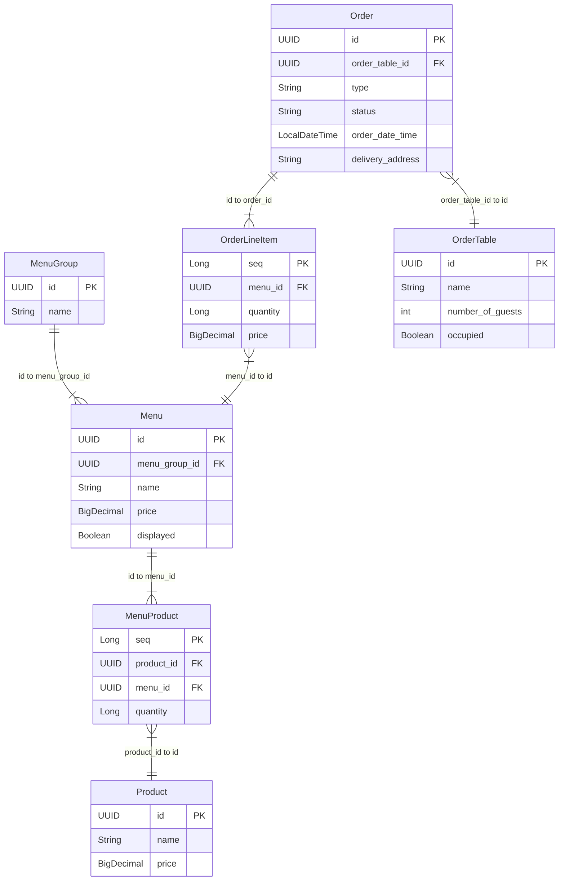

# 키친포스

## 퀵 스타트

```sh
cd docker
docker compose -p kitchenpos up -d
```

## 요구 사항

> 아래는 `도메인별 API` 기준으로 요구 사항을 정리했습니다.
>
> 도메인:  `상품`, `메뉴 그룹`, `메뉴`, `주문`, `주문 테이블`

### 상품(Product)

- **상품을 등록할 수 있다.**
  - [ ] 상품의 가격이 존재해야 하며 0보다 커야 한다. 만약 그렇지 않으면 예외가 발생한다.
  - [ ] 상품의 이름이 없거나 부적절한 단어(비속어)가 포함되면 예외가 발생한다.

- **상품의 가격을 변경할 수 있다.**
  - [ ] 상품의 가격이 존재해야 하며 0보다 커야 한다. 만약 그렇지 않으면 예외가 발생한다.
  - [ ] 상품에 대한 ID가 존재해야 한다.
  - [ ] 메뉴에 포함된 상품들의 총 가격(sum, 상품 가격 * 수량)은 메뉴 가격보다 작으면 안 된다.
    - 만약 메뉴 가격이 상품들의 총 가격보다 클 경우, 메뉴는 숨김 처리된다.

- **등록된 상품을 모두 조회할 수 있다.**
  - [ ] 등록된 상품을 모두 조회할 수 있다.

### 메뉴 그룹(Menu Group)

- **메뉴 그룹을 등록한다.**
  - [ ] 메뉴 그룹명이 존재해야 한다. 만약 메뉴 그룹명이 없거나 빈 값이면 예외가 발생한다.

- **등록된 메뉴 그룹을 모두 조회할 수 있다.**

### 메뉴(Menu)

- **메뉴를 등록할 수 있다.**
  - [ ] 메뉴 가격 검증
    - 메뉴 가격은 0원 이상이어야 한다. 만약 그렇지 않으면 예외가 발생한다.
  - [ ] 메뉴 그룹 검증
    - 메뉴는 특정 메뉴 그룹에 속해야 한다. 만약 그렇지 않으면 예외가 발생한다.
  - [ ] 메뉴 상품 존재 여부
    - 메뉴에 포함된 상품이 하나 이상 있어야 한다. 만약 상품이 없거나 비어 있으면 예외가 발생한다.
  - [ ] 상품 수와 실제 상품 개수 비교
    - 메뉴에 등록된 상품 개수와 실제 상품 개수가 일치해야 한다. 만약 다르면 예외가 발생한다.
  - [ ] 상품 수량 검증
    - 메뉴에 등록된 상품의 수량은 0개 이상이어야 한다. 만약 상품의 수량이 0보다 작으면 예외가 발생한다.
  - [ ] 상품 총 가격 검증
    - 메뉴 가격은 포함된 상품들의 총 가격(각 상품 가격 × 수량)의 합보다 클 수 없다. 만약 메뉴 가격이 상품 총 가격보다 크면 예외가 발생한다.
  - [ ] 메뉴 이름 검증
    - 메뉴 이름이 `null`, 빈 값(`""`), 공백 문자(`" "`)이거나 부적절한 단어가 포함되면 예외가 발생한다.

- **메뉴에 있는 가격을 변경할 수 있다.**
  - [ ] 메뉴 가격 검증 - 메뉴 가격을 변경할 때 가격이 0원 이상이어야 한다. 만약 그렇지 않으면 예외가 발생한다.
  - [ ] 상품 총 가격 검증 - 메뉴 가격은 포함된 상품들의 총 가격(각 상품 가격 × 수량)의 합보다 클 수 없다. 메뉴 가격이 상품 총 가격보다 크면 예외가 발생한다.

- **메뉴를 표시 상태로 변경할 수 있다.**
  - [ ] 메뉴가 존재해야 한다. 만약 메뉴가 존재하지 않으면 예외가 발생한다.
  - [ ] 메뉴를 표시하려면 표시 상태(displayed)가 `true`로 변경된다.
  - [ ] 메뉴를 표시하려면 메뉴 가격이 포함된 상품들의 총 가격(각 상품 가격 × 수량)의 합보다 클 수 없다. 메뉴 가격이 상품들의 총 가격보다 크면 예외가 발생한다.

- **등록된 메뉴를 숨길 수 있다.**
  - [ ] 메뉴가 존재해야 한다. 만약 메뉴가 존재하지 않으면 예외가 발생한다.
  - [ ] 메뉴를 숨기기 위해 표시 상태(displayed)가 `false`로 변경된다.

- **등록된 메뉴를 모두 조회할 수 있다.**

### 주문(Order)

> 주문 유형은 `배달`(DELIVERY), `포장`(TAKEOUT), `매장 내 식사`(EAT_IN) 가 있다.
>
> 주문 상태는 `주문 대기`(WAITING), `주문 접수`(ACCEPTED), `서빙 완료`(SERVED), `배달중`(DELIVERING), `배달 완료`(DELIVERED), `주문 완료`(COMPLETED) 가 있다.

- **주문을 등록할 수 있다.**
  - [ ] 주문 유형이 존재해야 한다.
  - [ ] 주문 항목이 존재해야 한다.
  - [ ] 주문 유형이 `배달` 혹은 `포장`시 주문 항목에 있는 수량이 0보다 커야 한다.
  - [ ] 주문 유형이 `매장 내 식사`인 경우 주문 수량이 0보다 작을 수 있다.
  - [ ] 주문 항목과 연관된 메뉴가 존재해야 한다.
  - [ ] 메뉴가 표시되어야 주문이 가능하다.
  - [ ] 주문 항목에 있는 가격이 메뉴에 있는 가격과 동일해야 한다.
  - [ ] 주문 유형이 `배달`이면 배달에 필요한 주소가 존재해야 한다.
  - [ ] 주문 유형이 `매장 내 식사`이면 가게 안에 자리가 꽉 차지 않아야 한다.

- **주문을 승인할 수 있다.**
  - [ ] 주문이 존재해야 한다.
  - [ ] 주문 상태가 `주문 대기` 여야 한다.
  - [ ] 주문 상태가 `배달중` 이면 배달 라이더에게 주문에 대한 정보(주문 총 가격, 배달 주소)를 제공해줘야 한다.

- **주문을 서빙한다.**
  - [ ] 주문이 존재해야 한다.
  - [ ] 주문 상태가 `주문 접수` 여야 한다.
  - [ ] 주문 상태를 `서빙 완료` 로 변경한다.

- **배달을 시작한다.**
  - [ ] 주문이 존재해야 한다.
  - [ ] 주문 유형이 `배달` 이고 주문 상태가 `서빙 완료` 여야 한다.
  - [ ] 주문 상태를 `배달중` 으로 변경한다.

- **배달을 완료한다.**
  - [ ] 주문이 존재해야 한다.
  - [ ] 주문 상태가 `배달중` 이어야 한다.
  - [ ] 주문 상태를 `배달 완료` 로 변경한다.

- **주문을 완료한다.**
  - [ ] 주문이 존재해야 한다.
  - [ ] 주문 유형이 `배달` 이면 주문 상태가 `배달 완료` 여야 한다.
  - [ ] 주문 유형이 `포장` 또는 `매장 내 식사` 이면 주문 상태가 `서빙 완료` 여야 한다.
  - [ ] 주문 유형이 `매장 내 식사` 이면 주문 상태가 `주문 완료` 로 변경한다.
  - [  ]주문 유형이 `매장 내 식사` 이고 해당 테이블에 진행 중인 주문이 하나도 없다면 손님 수를 0명으로 하고, 자리가 비어있다고 변경한다.

- **등록된 주문을 모두 조회할 수 있다.**

### 주문 테이블(OrderTable)

> 테이블 사용 여부(`occupied`)에서 false 는 `사용 가능` 상태이고, true 는 `사용중` 상태를 의미한다.

- **주문 테이블을 등록할 수 있다.**
  - [ ] 주문 테이블의 이름이 없으면 등록할 수 없다.
  - [ ] 손님 수가 0명이고 테이블 사용 여부가 `사용 가능` 상태여야 한다.

- **주문 테이블에 손님이 앉으면 사용중 상태로 변경한다.**
  - [ ] 주문 테이블이 존재해야 한다.
  - [ ] 테이블 사용 여부를 `사용중` 으로 변경된다.

- **주문이 완료된 경우, 주문 테이블을 정리한다.**
  - [ ] 주문 테이블이 존재해야 한다.
  - [ ] 주문 상태가 `완료` 인 경우 해당 손님 수를 `0`으로 설정하고, 테이블 사용 여부를 `사용 가능` 상태로 변경된다.

- **주문 테이블에 있는 손님 수를 변경할 수 있다.**
  - [ ] 손님 수가 `0`명 이상이어야 한다. 0명 미만이면 예외가 발생한다.
  - [ ] 주문 테이블이 존재해야 한다.
  - [ ] 테이블 사용 여부가 `사용중`(true) 이어야 한다.
  - [ ] 위의 조건을 모두 만족하면 해당 손님 수를 변경한다.

- **등록된 주문 테이블을 모두 조회할 수 있다.**
  - [ ] 등록된 주문 테이블을 모두 조회할 수 있다.


---

## 용어 사전

### 상품

> 상품을 관리하는 영역
> 
> 사장님(또는 관리자)가 재고에 등록할 상품을 구성할 때 사용한다.

| 한글명   | 영문명          | 설명                                                     |
|-------|--------------|--------------------------------------------------------|
| 상품    | Product      | 재고에 등록할 개별 상품. e.g. 후라이드 치킨, 양념 치킨, 허니머스타드 소스, 콜라 500ml |
| 상품 이름 | name  | 재고에 등록할 상품 이름                                          |
| 상품 가격 | price | 재고에 등록할 상품 가격                                          |


### 메뉴

> 고객에게 판매할 메뉴를 관리하는 영역
>
> 상품을 묶어 메뉴를 구성하고, 메뉴를 묶어 메뉴 그룹을 구성할 때 사용한다.

| 한글명         | 영문명        | 설명                                                                                                                                             |
| -------------- | ------------- | ------------------------------------------------------------------------------------------------------------------------------------------------ |
| 메뉴           | Menu          | 고객에게 판매할 1개 이상의 상품을 포함한 리스트. e.g. 후라이드 치킨, 양념치킨, 반반치킨                                                              |
| 메뉴 이름      | name      | 비속어가 포함되지 않은 메뉴의 이름                                                                                                               |
| 메뉴 가격      | price     | 메뉴에 포함된 상품들의 총 가격(각 상품 가격 × 수량)                                                                                                |
| 메뉴 노출 여부 | displayed | 고객에게 해당 메뉴를 노출할지 여부. 판매 가능 시 `true`, 판매 불가능 시 `false`                                                                            |
| 메뉴 그룹      | MenuGroup     | 비슷한 메뉴를 묶는 카테고리. e.g. 메인 메뉴(후라이드 치킨, 양념치킨), 세트 메뉴(후라이드 치킨 + 감자튀김), 사이드 메뉴(감자 튀김), 추가(콜라, 생맥주) |
| 메뉴 상품      | MenuProduct   | 하나의 메뉴에 포함된 개별 상품과 그 수량을 의미. e.g. 후라이드 치킨(치킨 1마리, 허니머스타드 소스, 콜라 500ml)                                        |

### 주문

> 고객이 주문한 음식이 고객에게 전달하기 까지의 모든 과정
> 
> 주문 과정은 매장 주문, 포장 주문, 배달 주문으로 구성되어 있다.
>
> 손님(`Guest`) 는 주문을 요청한 고객을 의미한다.

| 한글명   | 영문명             | 설명                                                                                                                                      |
|-------|-----------------|-----------------------------------------------------------------------------------------------------------------------------------------|
| 주문    | Order           | 고객이 요청한 메뉴들의 집합                                                                                                                         |
| 주문 유형 | OrderType       | 고객의 주문 유형. e.g. `배달`(DELIVERY), `포장`(TAKEOUT), `매장 내 식사`(EAT_IN)                                                                        |
| 매장 주문 | eat in          | (주문 유형) 손님이 매장에서 메뉴를 제공받는 주문                                                                                                            |
| 포장 주문 | takeout         | (주문 유형) 손님이 매장에 방문해서 메뉴를 가져가는 주문                                                                                                        |
| 배달 주문 | delivery        | (주문 유형) 손님에게 메뉴를 배달 장소로 배달하는 주문                                                                                                         |
| 주문 상태   | OrderStatus     | 고객이 요청할 때 주문의 진행 상태. e.g. `주문 대기`(WAITING), `주문 접수`(ACCEPTED), `서빙 완료`(SERVED), `배달중`(DELIVERING), `배달 완료`(DELIVERED), `주문 완료`(COMPLETED) |
| 주문 대기   | waiting         | (주문 상태) 고객이 음식을 주문했고, 사장님이 해당 주문을 확인하지 못한 상태                                                                                            |
| 주문 접수   | accepted        | (주문 상태) 사장님이 해당 주문을 확인한 뒤 승인한 상태                                                                                                        |
| 서빙 완료   | served          | (주문 상태) (매장 내 식사 또는 포장인 경우) 고객이 주문한 음식이 나왔고, 해당 음식을 고객에게 제공한 상태 / (배달인 경우) 고객이 주문한 음식이 나왔고, 해당 음식을 배달 기사님에게 제공한 상태                      |
| 배달 중    | delivering      | (주문 상태) (배달인 경우) 배달 기사님이 고객에 있는 집으로 가는 중인 상태                                                                                            |
| 배달 완료   | deliverd        | (주문 상태) (배달인 경우) 배달 기사님이 고객의 집에 도착해서 해당 음식을 문앞에 놓고 간 상태                                                                                 |
| 주문 완료   | completed       | (주문 상태) 고객이 해당 음식을 받은 상태                                                                                                                |
| 주문이 접수된 날짜   | orderDateTime   | 고객이 주문했을 때의 해당 날짜                                                                                                                       |
| 배달 주소   | deliveryAddress | 주문한 고객의 주소                                                                                                                              |
| 주문 항목   | OrderLineItem   | 주문에 포함된 개별 메뉴의 수량과 가격을 나타내는 항목                                                                                                          |

### 매장 주문

| 한글명      | 영문명            | 설명                                                                                                                                     |
|----------|----------------|----------------------------------------------------------------------------------------------------------------------------------------|
| 주문    | Order           | 매장에서 식사하는 고객 대상. 손님들이 매장에서 먹을 수 있도록 조리된 음식을 가져다준다.                                                                                     |
| 주문 테이블   | OrderTable     | 매장 내 식사하는 손님을 위한 테이블                                                                                                                   |
| 테이블 이름   | name           | 테이블 이름                                                                                                                                 |
| 손님 수     | numberOfGuests | 테이블에 앉아있는 손님 수                                                                                                                         |
| 테이블 사용 여부 | occupied       | 테이블이 사용 중인지 여부. e.g. 사용 가능하면 false, 사용중이면 true                                                                                         |
| 주문 상태   | OrderStatus     | 고객이 주문을 요청하면 해당 주문을 매장에서 접수하고 고객에게 음식을 제공하기까지의 단계를 표시한다. e.g. `주문 대기`(WAITING), `주문 접수`(ACCEPTED), `서빙 완료`(SERVED), `주문 완료`(COMPLETED) |
| 주문 대기   | waiting         | (주문 상태) 매장에 있는 고객이 음식을 주문했고, 사장님이 해당 주문을 확인하지 못한 상태                                                                                    |
| 주문 접수   | accepted        | (주문 상태) 사장님이 해당 주문을 확인한 뒤 승인한 상태                                                                                                       |
| 서빙 완료   | served          | (주문 상태) 고객이 주문한 음식이 나왔고, 해당 음식을 고객에게 제공한 상태                                                                                            |
| 주문 완료   | completed       | (주문 상태) 고객이 해당 음식을 받은 상태                                                                                                               |
| 주문 항목   | OrderLineItem   | 주문에 포함된 개별 메뉴의 수량과 가격을 나타내는 항목                                                                                                         |

### 포장 주문

| 한글명      | 영문명            | 설명                                                                                                                                     |
|----------|----------------|----------------------------------------------------------------------------------------------------------------------------------------|
| 주문    | Order           | 배달하는 고객 대상. 집이나 직장 등 고객이 선택한 주소로 음식을 배달한다.                                                                                              |
| 주문 상태   | OrderStatus     | 고객이 주문을 요청하면 해당 주문을 매장에서 접수하고 고객에게 음식을 제공하기까지의 단계를 표시한다. e.g. `주문 대기`(WAITING), `주문 접수`(ACCEPTED), `서빙 완료`(SERVED), `주문 완료`(COMPLETED) |
| 주문 대기   | waiting         | (주문 상태) 고객이 음식을 주문했고, 사장님이 해당 주문을 확인하지 못한 상태                                                                                           |
| 주문 접수   | accepted        | (주문 상태) 사장님이 해당 주문을 확인한 뒤 승인한 상태                                                                                                       |
| 서빙 완료   | served          | (주문 상태) 고객이 주문한 음식이 나왔고, 해당 음식을 고객에게 제공한 상태                                                                                            |
| 주문 완료   | completed       | (주문 상태) 고객이 해당 음식을 받은 상태                                                                                                               |
| 주문 항목   | OrderLineItem   | 주문에 포함된 개별 메뉴의 수량과 가격을 나타내는 항목                                                                                                         |


### 배달 주문

| 한글명     | 영문명        | 설명                                                                                                                                                                      |
|---------| ------------- |-------------------------------------------------------------------------------------------------------------------------------------------------------------------------|
| 주문    | Order           | 포장하는 고객 대상. 고객이 매장에서 직접 음식을 수령한다.                                                                                                                                       |
| 주문 상태   | OrderStatus     | 고객이 주문을 요청하면 해당 주문을 매장에서 접수하고 고객에게 음식을 제공하기까지의 단계를 표시한다. e.g. `주문 대기`(WAITING), `주문 접수`(ACCEPTED), `서빙 완료`(SERVED), `배달중`(DELIVERING), `배달 완료`(DELIVERED), `주문 완료`(COMPLETED) |
| 주문 대기   | waiting         | (주문 상태) 고객이 음식을 주문했고, 사장님이 해당 주문을 확인하지 못한 상태                                                                                                                            |
| 주문 접수   | accepted        | (주문 상태) 사장님이 해당 주문을 확인한 뒤 승인한 상태                                                                                                                                        |
| 서빙 완료   | served          | (주문 상태) 고객이 주문한 음식이 나왔고, 해당 음식을 배달원에게 제공한 상태                                                                                                                            |
| 배달 중    | delivering      | (주문 상태) 배달 기사님이 고객에 있는 집 또는 직장으로 가는 중인 상태                                                                                                                               |
| 배달 완료   | deliverd        | (주문 상태)  배달 기사님이 고객의 집 또는 직장에 도착해서 해당 음식을 문앞에 놓고 간 상태                                                                                                                   |
| 주문 완료   | completed       | (주문 상태) 고객이 해당 음식을 받은 상태                                                                                                                                                |
| 주문 항목   | OrderLineItem   | 주문에 포함된 개별 메뉴의 수량과 가격을 나타내는 항목                                                                                                                                          |
| 배달 | delivering | 배달원이 매장을 방문하여 배달 음식의 픽업을 완료하고 배달을 시작하는 단계 |
| 배달 대행사 | delivery agency | 준비한 음식을 고객에게 직접 배달하는 서비스 |

---

## 모델링

> 아래는 `Mermaid` 로 표현한 ER Diagram 입니다.
> ER Diagram 아래에는 바운디드 컨텍스트를 기준으로 `속성(상태)`, `행위(기능)`, `정책(제약사항)`을 카테고리로 나눠서 작성했습니다.




### 상품

#### 속성(상태)
- 상품(`Product`) 에는 재고에 등록할 상품 이름(`name`)과 상품 가격(`price`)이 있다.

#### 행위(기능)
- 상품을 등록할 수 있다.
- 상품의 가격을 변경할 수 있다.
- 등록된 상품을 모두 조회할 수 있다.

#### 정책(제약사항)
> 아래는 행위(기능)에 대한 정책 사항(제약 사항)을 depth 로 구분하여 작성했습니다.

- 상품을 등록할 수 있다.
  - 상품의 가격이 존재해야 하며 0보다 커야 한다.
  - 상품의 이름이 없거나 부적절한 단어(비속어)가 포함되면 인된다.

- 상품의 가격을 변경할 수 있다.
  - 상품의 가격이 존재해야 하며 0보다 커야 한다.
  - 상품에 대한 ID가 존재해야 한다
  - 메뉴에 포함된 상품들의 총 가격(sum, 상품 가격 * 수량)은 메뉴 가격보다 작으면 안 된다.

### 메뉴

#### 속성(상태)
- 메뉴(`Menu`)
  - 메뉴(`Menu`)에는 메뉴 이름(`name`), 메뉴 가격(`price`), 메뉴 노출 여부(`displayed`) 가 있다.
  - 하나의 메뉴 그룹(`MenuGroup`)에 속한다.
  - 여러 개의 메뉴 상품(`MenuProduct`)을 포함할 수 있다.

- 메뉴 그룹(`MenuGroup`)
  - 메뉴 그룹(`MenuGroup`)에는 메뉴 그룹 이름(`name`)이 있다.
  - 여러 개의 메뉴(`Menu`)를 포함할 수 있다.

- 메뉴 상품(`MenuProduct`)
  - 개별 상품(`Product`)과 수량(`quantity`) 정보를 가진다.
  - 하나의 `Product`를 참조하며, `Menu`와 `Product` 간의 연결 정보를 관리하는 **중간 엔티티** 역할을 수행한다.

#### 행위(기능)
- 메뉴(`Menu`)
  - 메뉴를 등록할 수 있다.
  - 메뉴에 있는 가격을 변경할 수 있다.
  - 메뉴를 표시 상태를 변경할 수 있다.
  - 등록된 메뉴를 숨길 수 있다.
  - 등록된 메뉴를 모두 조회할 수 있다.

- 메뉴 그룹(`MenuGroup`)
  - 메뉴 그룹을 등록한다.
  - 메뉴 그룹을 조회한다.

#### 정책(제약사항)
> 아래는 행위(기능)에 대한 정책 사항(제약 사항)을 depth 로 구분하여 작성했습니다.

- 메뉴를 등록할 수 있다.
  - 메뉴 가격 검증
    - 메뉴에 가격은 0원 이상이어야 한다.
  - 메뉴 그룹 검증
    - 메뉴는 특정 메뉴 그룹에 속해야 한다.
  - 메뉴 상품 존재 여부
    - 메뉴에 포함된 상품이 하나 이상 있어야 한다.
  - 상품 수와 실제 상품 개수 비교
    - 메뉴에 등록된 상품 개수와 실제 상품 개수가 일치해야 한다.
  - 상품 수량 검증
    - 메뉴에 등록된 상품의 수량은 0개 이상이어야 한다.
  - 상품 총 가격 검증
    - 메뉴 가격은 포함된 상품들의 총 가격(각 상품 가격 × 수량)의 합보다 클 수 없다. (작거나 같아야 한다)
  - 메뉴 이름 검증
    - 메뉴 이름이 `null`, 빈 값(`""`), 공백 문자(`" "`)이거나 부적절한 단어가 포함되면 예외가 발생한다.

- 메뉴에 있는 가격을 변경할 수 있다.
  - 메뉴 가격 검증
    - 메뉴 가격을 변경할 때 가격이 0원 이상이어야 한다.
  - 상품 총 가격 검증
    - 메뉴 가격은 포함된 상품들의 총 가격(각 상품 가격 × 수량)의 합보다 클 수 없다.

- 메뉴를 표시 상태를 변경할 수 있다.
  - 메뉴가 존재해야 한다.
  - 메뉴를 표시하려면 표시 상태(displayed)가 true로 변경된다.
  - 메뉴를 표시하려면 메뉴 가격이 포함된 상품들의 총 가격(각 상품 가격 × 수량)의 합보다 클 수 없다.

- 등록된 메뉴를 숨길 수 있다.
  - 메뉴가 존재해야 한다.
  - 메뉴를 숨기기 위해 표시 상태(displayed)가 false로 변경된다.

- 등록된 메뉴를 모두 조회할 수 있다.

- 메뉴 그룹을 등록한다.
  - 메뉴 그룹명이 존재해야 한다.

- 등록된 메뉴 그룹을 모두 조회할 수 있다.


### 주문

#### 속성(상태)
- 주문(`Order`)은 주문 유형(`OrderType`), 주문 상태(`OrderStatus`), 주문이 접수된 날짜(`orderDateTime`), 배달 주소(`deliveryAddress`)가 있다.
- 주문(`Order`)은 하나 또는 여러개의 주문 항목(`OrderLineItem`)을 가질 수 있다.
- 주문 항목(`OrderLineItem`)은 주문에 포함된 개별 메뉴의 수량(`quantity`)과 가격(`price`)을 가진다.

#### 행위(기능)
- 주문을 등록할 수 있다.
- 주문을 승인할 수 있다.
- 주문을 서빙한다.
- 배달을 시작한다.
- 배달을 완료한다.
- 주문을 완료한다.
- 등록된 주문을 전체 조회할 수 있다.

#### 정책(제약사항)
> 아래는 행위(기능)에 대한 정책 사항(제약 사항)을 depth 로 구분하여 작성했습니다.

- 주문을 등록할 수 있다.
  - 주문 유형이 존재해야 한다.
  - 주문 항목이 존재해야 한다.
  - 주문 유형이 `배달` 혹은 `포장`시 주문 항목에 있는 수량이 0보다 커야 한다.
  - 주문 유형이 `매장 내 식사`인 경우 주문 항목에 있는 수량이 0보다 작을 수 있다.
  - 주문 항목과 연관된 메뉴가 존재해야 한다.
  - 메뉴가 표시되어야 주문이 가능하다.
  - 주문 항목에 있는 가격이 메뉴에 있는 가격과 동일해야 한다.
  - 주문 유형이 `배달`이면 배달에 필요한 주소가 존재해야 한다.
  - 주문 유형이 `매장 내 식사`이면 가게 안에 자리가 꽉 차지 않아야 한다.

- 주문을 승인할 수 있다.
  - 주문이 존재해야 한다.
  - 주문 상태가 `주문 대기` 여야 한다.
  - 주문 상태가 `배달중` 이면 배달 라이더에게 주문에 대한 정보(주문 총 가격, 배달 주소)를 제공해줘야 한다.

- 주문을 서빙한다.
  - 주문이 존재해야 한다.
  - 주문 상태가 `주문 접수` 여야 한다.
  - 주문 상태를 `서빙 완료` 로 변경한다.

- 배달을 시작한다.
  - 주문이 존재해야 한다.
  - 주문 유형이 `배달` 이고 주문 상태가 `서빙 완료` 여야 한다.
  - 주문 상태를 `배달중` 으로 변경한다.

- 배달을 완료한다.
  - 주문이 존재해야 한다.
  - 주문 상태가 `배달중` 이어야 한다.
  - 주문 상태를 `배달 완료` 로 변경한다.

- 주문을 완료한다.
  - 주문이 존재해야 한다
  - 주문 유형이 `배달` 이면 주문 상태가 `배달 완료` 여야 한다.
  - 주문 유형이 `포장` 또는 `매장 내 식사` 이면 주문 상태가 `서빙 완료` 여야 한다.
  - 주문 유형이 `매장 내 식사` 이면 주문 상태가 `주문 완료` 로 변경한다.
  - 주문 유형이 `매장 내 식사` 이고 해당 테이블에 진행 중인 주문이 하나도 없다면 손님 수를 0명으로 하고, 자리가 비어있다고 변경한다.

- 등록된 주문을 모두 조회할 수 있다.

---

> 주문 유형을 세분화하면 `매장 주문`, `포장 주문`, `배달 주문`이 있다.

### 매장 주문(EAT_IN)

> 매장에서 식사하는 고객 대상. 손님들이 매장에서 먹을 수 있도록 조리된 음식을 가져다준다.
> 
> 주문 흐름: 주문 대기 -> 주문 접수 -> 서빙 완료 -> 주문 완료 순서로 진행된다.

#### 속성(상태)
- 주문(`Order`)은 식별자와, 주문 상태(`OrderStatus`), 주문이 접수된 날짜(`orderDateTime`), 주문 항목(`OrderLineItems`)를 가진다.
- 하나의 주문 테이블(`OrderTable`)은 하나 이상의 주문(`Order`)을 가질 수 있다.
- 주문 테이블(`OrderTable`)은 테이블 이름(`name`), 손님 수(`numberOfGuests`), 테이블 사용 여부(`occupied`)를 가진다.
- 주문 항목(`OrderLineItem`)은 주문에 포함된 개별 메뉴의 수량(`quantity`)과 가격(`price`)을 가진다.

#### 행위(기능)
- 주문을 등록할 수 있다.
- 손님이 착석하면 테이블을 사용 중 상태(occupied=true)로 변경할 수 있다.
- 주문이 완료된 경우, 주문 테이블을 정리할 수 있다.
- 주문 테이블의 손님 수를 변경할 수 있다.

#### 정책(제약사항)
- 주문 유형이 매장 내 식사(`EAT_IN`)이면, 매장에 이용 가능한 테이블이 있어야 한다.
- 손님이 착석하면 테이블 사용 여부를 사용 중(`true`) 상태로 변경한다.
- 주문 완료 후 해당 테이블에 진행 중인 주문이 없으면
  - 손님 수(`numberOfGuests`)를 0으로 설정한다.
  - 테이블을 비어 있음(occupied=false) 상태로 변경한다.

### 포장 주문 (TAKEOUT)

> 고객이 매장에 방문하여 직접 음식을 가져가는 주문.
> 
> 주문 흐름: 주문 대기 -> 주문 접수 -> 서빙 완료 -> 주문 완료 순서로 진행된다.

#### 속성(상태)
- 주문(`Order`)은 식별자와, 주문 상태(`OrderStatus`), 주문이 접수된 날짜(`orderDateTime`), 주문 항목(`OrderLineItems`)를 가진다.
- 주문 항목(`OrderLineItem`)은 주문에 포함된 개별 메뉴의 수량(`quantity`)과 가격(`price`)을 가진다.

#### 행위(기능)
- 주문을 등록할 수 있다. 
- 주문을 승인할 수 있다. 
- 주문을 서빙할 수 있다. 
- 주문을 완료할 수 있다.

#### 정책(제약사항)
- 주문 유형이 포장(`TAKEOUT`)인 경우, 주문 항목의 수량은 0보다 커야 한다.

### 배달 주문 (DELIVERY)

> 고객이 매장에서 직접 수령하지 않고 배달을 요청하는 주문.
>
> 주문 흐름: 주문 대기 -> 주문 접수 -> 서빙 완료 -> 배달 중 -> 배달 완료 -> 주문 완료 순서로 진행된다.

#### 속성(상태)
- 주문(`Order`)은 식별자와, 주문 상태(`OrderStatus`), 주문이 접수된 날짜(`orderDateTime`), 배달 주소(`deliveryAddress`), 주문 항목(`OrderLineItems`)를 가진다.
- 주문 항목(`OrderLineItem`)은 주문에 포함된 개별 메뉴의 수량(`quantity`)과 가격(`price`)을 가진다.

#### 행위(기능)
- 주문을 등록할 수 있다.
- 주문을 승인할 수 있다.
- 주문을 서빙할 수 있다.
- 배달을 시작할 수 있다.
- 배달을 완료할 수 있다.
- 주문을 완료할 수 있다.

#### 정책(제약사항)
- 주문 유형이 배달(`DELIVERY`)인 경우, 배달 주소(`deliveryAddress`)가 반드시 존재해야 한다.
- 주문이 접수되면 배달 대행사(`delivery agency`)가 호출된다.
- 배달을 시작하면 주문 상태를 배달 중(`DELIVERING`)으로 변경한다.
- 배달이 완료되면 주문 상태를 배달 완료(`DELIVERED`)로 변경한다.
