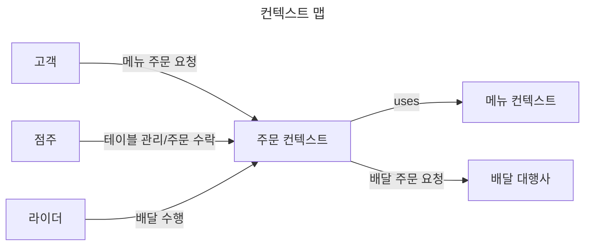
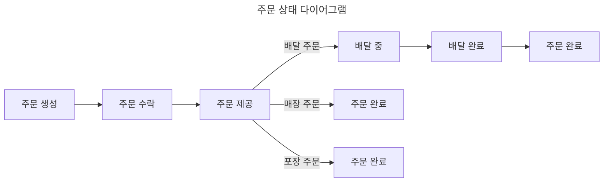

# 키친포스

## 퀵 스타트

```sh
cd docker
docker compose -p kitchenpos up -d
```

## 요구 사항

### 상품

- 상품을 등록할 수 있다.
- 상품의 가격이 올바르지 않으면 등록할 수 없다.
  - 상품의 가격은 0원 이상이어야 한다.
- 상품의 이름이 올바르지 않으면 등록할 수 없다.
  - 상품의 이름에는 비속어가 포함될 수 없다.
- 상품의 가격을 변경할 수 있다.
- 상품의 가격이 올바르지 않으면 변경할 수 없다.
  - 상품의 가격은 0원 이상이어야 한다.
- 상품의 가격이 변경될 때 메뉴의 가격이 메뉴에 속한 상품 금액의 합보다 크면 메뉴가 숨겨진다.
- 상품의 목록을 조회할 수 있다.

### 메뉴 그룹

- 메뉴 그룹을 등록할 수 있다.
- 메뉴 그룹의 이름이 올바르지 않으면 등록할 수 없다.
  - 메뉴 그룹의 이름은 비워 둘 수 없다.
- 메뉴 그룹의 목록을 조회할 수 있다.

### 메뉴

- 1 개 이상의 등록된 상품으로 메뉴를 등록할 수 있다.
- 상품이 없으면 등록할 수 없다.
- 메뉴에 속한 상품의 수량은 0 이상이어야 한다.
- 메뉴의 가격이 올바르지 않으면 등록할 수 없다.
  - 메뉴의 가격은 0원 이상이어야 한다.
- 메뉴에 속한 상품 금액의 합은 메뉴의 가격보다 크거나 같아야 한다.
- 메뉴는 특정 메뉴 그룹에 속해야 한다.
- 메뉴의 이름이 올바르지 않으면 등록할 수 없다.
  - 메뉴의 이름에는 비속어가 포함될 수 없다.
- 메뉴의 가격을 변경할 수 있다.
- 메뉴의 가격이 올바르지 않으면 변경할 수 없다.
  - 메뉴의 가격은 0원 이상이어야 한다.
- 메뉴에 속한 상품 금액의 합은 메뉴의 가격보다 크거나 같아야 한다.
- 메뉴를 노출할 수 있다.
- 메뉴의 가격이 메뉴에 속한 상품 금액의 합보다 높을 경우 메뉴를 노출할 수 없다.
- 메뉴를 숨길 수 있다.
- 메뉴의 목록을 조회할 수 있다.

### 주문 테이블

- 주문 테이블을 등록할 수 있다.
- 주문 테이블의 이름이 올바르지 않으면 등록할 수 없다.
  - 주문 테이블의 이름은 비워 둘 수 없다.
- 빈 테이블을 해지할 수 있다.
- 빈 테이블로 설정할 수 있다.
- 완료되지 않은 주문이 있는 주문 테이블은 빈 테이블로 설정할 수 없다.
- 방문한 손님 수를 변경할 수 있다.
- 방문한 손님 수가 올바르지 않으면 변경할 수 없다.
  - 방문한 손님 수는 0 이상이어야 한다.
- 빈 테이블은 방문한 손님 수를 변경할 수 없다.
- 주문 테이블의 목록을 조회할 수 있다.

### 주문

- 1개 이상의 등록된 메뉴로 배달 주문을 등록할 수 있다.
- 1개 이상의 등록된 메뉴로 포장 주문을 등록할 수 있다.
- 1개 이상의 등록된 메뉴로 매장 주문을 등록할 수 있다.
- 주문 유형이 올바르지 않으면 등록할 수 없다.
- 메뉴가 없으면 등록할 수 없다.
- 매장 주문은 주문 항목의 수량이 0 미만일 수 있다.
- 매장 주문을 제외한 주문의 경우 주문 항목의 수량은 0 이상이어야 한다.
- 배달 주소가 올바르지 않으면 배달 주문을 등록할 수 없다.
  - 배달 주소는 비워 둘 수 없다.
- 빈 테이블에는 매장 주문을 등록할 수 없다.
- 숨겨진 메뉴는 주문할 수 없다.
- 주문한 메뉴의 가격은 실제 메뉴 가격과 일치해야 한다.
- 주문을 접수한다.
- 접수 대기 중인 주문만 접수할 수 있다.
- 배달 주문을 접수되면 배달 대행사를 호출한다.
- 주문을 서빙한다.
- 접수된 주문만 서빙할 수 있다.
- 주문을 배달한다.
- 배달 주문만 배달할 수 있다.
- 서빙된 주문만 배달할 수 있다.
- 주문을 배달 완료한다.
- 배달 중인 주문만 배달 완료할 수 있다.
- 주문을 완료한다.
- 배달 주문의 경우 배달 완료된 주문만 완료할 수 있다.
- 포장 및 매장 주문의 경우 서빙된 주문만 완료할 수 있다.
- 주문 테이블의 모든 매장 주문이 완료되면 빈 테이블로 설정한다.
- 완료되지 않은 매장 주문이 있는 주문 테이블은 빈 테이블로 설정하지 않는다.
- 주문 목록을 조회할 수 있다.

## 용어 사전

### 이해관계자

| 한글명    | 영문명        | 설명                      |
|--------|------------|-------------------------|
| 점주     | Shop Owner | 매장을 운영하는 사장님            |
| 고객     | Customer   | 상품을 주문한 사람              |
| 라이더    | Rider      | 고객에게 상품을 배달한 사람         |
| 배달 대행사 | Agency     | 고객에게 음식을 배달할 라이더를 할당한다. |

### 상품

| 한글명 | 영문명     | 설명                |
|-----|---------|-------------------|
| 상품  | Product | 점주가 고객에게 제공하려는 음식 |

### 메뉴

| 한글명   | 영문명          | 설명                          |
|-------|--------------|-----------------------------|
| 메뉴    | Menu         | 상품의 조합, 고객에게 판매할 수 있는 최소 단위 |
| 노출 여부 | Displayed    | 메뉴를 고객에게 노출하거나 숨길 수 있다.     |
| 메뉴 상품 | Menu Product | 메뉴에 포함된 상품                  |
| 메뉴 그룹 | Menu Group   | 메뉴의 집합                      |

### 주문

**주문 테이블**

| 한글명    | 영문명                 | 설명                       |
|--------|---------------------|--------------------------|
| 주문 테이블 | Order Table         | 매장에서 주문을 받기 위한 테이블       |
| 고객의 수  | Number of Customers | 주문 테이블에서 식사 중인 고객의 수     |
| 점유 여부  | Occupied            | 고객이 주문 테이블을 사용 중인지 나타낸다. |

**주문**

| 한글명   | 영문명             | 설명                       |
|-------|-----------------|--------------------------|
| 주문    | Order           | 고객이 여러 메뉴를 선택한 후 구매하는 행위 |
| 주문 항목 | Order Line Item | 주문에 포함된 메뉴, 고객이 주문한 음식   |
| 주문 유형 | Order Type      | 고객이 음식을 주문한 방법           |
| 주문 상태 | Order Status    | 주문이 진행되는 과정을 나타낸다.       |
| 주문 일시 | Order DateTime  | 고객이 음식을 주문한 일시           |

**매장 주문**

| 한글명   | 영문명          | 설명                                        |
|-------|--------------|-------------------------------------------|
| 매장 주문 | Eat In Order | 고객이 매장을 방문하여 주문 테이블에서 주문한 음식을 먹는 것을 나타낸다. |
| 대기    | Waiting      | 고객이 주문을 하고 점주가 아직 확인하지 않은 상태              |
| 수락    | Accepted     | 점주가 고객의 주문을 수락한 상태                        |
| 제공    | Served       | 점주가 고객이 주문한 음식을 완성한 상태                    |
| 완료    | Completed    | 점주가 고객의 주문이 완료되었다고 최종적으로 판단한 상태           |

**포장 주문**

| 한글명   | 영문명            | 설명                              |
|-------|----------------|---------------------------------|
| 포장 주문 | Take Out Order | 고객이 매장을 방문하여 주문한 음식을 직접 수령한다.   |
| 대기    | Waiting        | 고객이 주문을 하고 점주가 아직 확인하지 않은 상태    |
| 수락    | Accepted       | 점주가 고객의 주문을 수락한 상태              |
| 제공    | Served         | 점주가 고객이 주문한 음식을 완성한 상태          |
| 완료    | Completed      | 점주가 고객의 주문이 완료되었다고 최종적으로 판단한 상태 |

**배달 주문**

| 한글명   | 영문명              | 설명                                |
|-------|------------------|-----------------------------------|
| 배달 주소 | Delivery Address | 고객이 주문한 음식을 수령하기를 원하는 장소          |
| 배달 주문 | Delivery Order   | 고객은 배송지 주소에서 주문한 음식을 라이더로부터 수령한다. |
| 대기    | Waiting          | 고객이 주문을 하고 점주가 아직 확인하지 않은 상태      |
| 수락    | Accepted         | 점주가 고객의 주문을 수락한 상태                |
| 제공    | Served           | 점주가 고객이 주문한 음식을 완성한 상태            |
| 배달 중  | Delivering       | 라이더가 완성된 음식을 수령하여 배달 중인 상태        |
| 배달 완료 | Delivered        | 고객이 지정한 장소에서 라이더로부터 음식을 수령한 상태    |
| 완료    | Completed        | 점주가 고객의 주문이 완료되었다고 최종적으로 판단한 상태   |

## 모델링

### 상품 (`Product`)

* 프로퍼티
  * 이름 (Name)
    * 이름은 필수값이다.
    * 이름은 비속어를 포함하지 않아야 한다.
  * 가격 (Price)
    * 가격은 필수값이다.
    * 가격은 0 이상이어야 한다.
* 유즈케이스
  * 상품을 추가한다.
  * 상품의 가격을 변경한다.
    * 이 상품을 메뉴 상품으로 사용하는 모든 메뉴를 검증해야 한다.
      * 메뉴 가격이 조합된 상품 가격의 총합 보다 크면 메뉴의 노출 여부를 숨김으로 변경한다.
  * 상품의 목록을 조회한다.

### 메뉴 (`Menu`)

* 프로퍼티
  * 이름 (Name)
    * 이름은 필수값이다
    * 이름은 비속어를 포함하지 않아야 한다.
  * 가격 (Price)
    * 가격은 필수값이다.
    * 가격은 0 이상이다.
  * 메뉴 그룹 (`Menu Group`)
    * 메뉴 그룹은 필수값이다.
  * 노출 여부 (`Displayed`)
    * 노출 여부는 필수값이다.
    * 값은 노출(`true`), 숨김(`false`)이다.
  * 메뉴 상품 목록 (`Menu Products`)
    * 메뉴 상품 목록은 1개 이상의 메뉴 상품을 가져야 한다.
* 유즈케이스
  * 메뉴를 추가한다.
    * 메뉴 가격은 포함된 메뉴 상품 가격의 총합 이하이어야 한다.
  * 메뉴를 노출한다.
    * 메뉴 가격은 포함된 메뉴 상품 가격의 총합 이하이어야 한다.
  * 메뉴를 숨긴다.
  * 모든 메뉴를 조회한다.

**메뉴 상품(`Menu Product`)**

* 프로퍼티
  * 상품 (`Product`)
    * 상품은 필수값이다.
  * 수량 (Quantity)
    * 수량은 필수값이다.

**메뉴 그룹(`Menu Group`)**

* 프로퍼티
  * 이름 (Name)
    * 이름은 필수값이다.
    * 이름은 비워 둘 수 없다.
* 유즈케이스
  * 메뉴 그룹을 등록한다.
  * 모든 메뉴 그룹의 목록을 조회한다.

### 주문 (`Order`)



**주문 테이블(`Order Table`)**

* 프로퍼티
  * 이름 (Name)
    * 이름은 필수값이다.
    * 이름은 비워 둘 수 없다.
    * 이름은 비속어를 포함하지 않아야 한다.
  * 고객의 수 (`Number of Customers`)
    * 고객의 수는 필수값이다.
    * 고객의 수는 0 이상이다.
    * 기본값은 0이다.
  * 점유 여부 (`Occupied`)
    * 점유 여부는 필수값이다.
    * 사용(`true`), 미사용(`false`) 중 하나이다.
    * 기본값은 미사용이다.
* 유즈케이스
  * 주문 테이블을 등록한다.
  * 주문 테이블을 사용한다.
    * 미사용 주문 테이블만 사용할 수 있다.
  * 주문 테이블을 정리한다.
    * 모든 주문의 주문 상태가 완료이어야 한다.
    * 고객의 수를 0으로 초기화한다.
    * 주문 테이블을 미사용으로 변경한다.
  * 고객의 수를 변경한다.
    * 주문 테이블이 사용 중이어야 한다.
  * 모든 주문 테이블의 목록을 조회한다.

**주문 항목 (`Order Line Item`)**

* 프로퍼티
  * 메뉴 (`Menu`)
    * 메뉴는 필수값이다.
    * 메뉴의 노출 여부는 노출이어야 한다.
  * 가격 (Price)
    * 가격은 필수값이다.
    * 주문 항목의 가격은 메뉴의 가격과 동일해야 한다.
  * 수량 (Quantity)
    * 수량은 필수값이다.
    * 수량은 0 이상이어야 한다.

**매장 주문(`Eat In Order`)**

* 프로퍼티
  * 주문 유형 (`Order Type`)
    * 주문 유형은 매장 주문(`Eat In Order`)이다.
  * 주문 상태 (`Order Status`)
    * 주문 상태는 필수값이다.
    * 기본값은 대기(`Waiting`)이다.
  * 주문 항목 목록 (`Order Line Items`)
  * 주문 일시 (`Order DateTime`)
    * 주문 일시는 필수값이다.
  * 주문 테이블 (`Order Table`)
    * 주문 테이블은 필수값이다.
* 유즈케이스
  * 매장에서 메뉴를 주문한다.
    * 주문 상태는 대기(`Waiting`)이다.
  * 메뉴 주문을 수락한다.
    * 대기(`Waiting`)인 주문만 수락할 수 있다.
    * 주문 상태를 수락(`Accepted`)으로 변경한다.
  * 주문받은 음식을 완성하여 주문 테이블에 제공한다.
    * 수락(`Accepted`)된 주문만 제공할 수 있다.
    * 주문 상태를 제공(`Served`)으로 변경한다.
  * 매장 주문을 완료한다.
    * 제공(`Served`)된 주문만 완료할 수 있다.
    * 주문 상태를 완료(`Completed`)로 변경한다.
    * 주문 테이블을 정리해야 한다.

**포장 주문(`Take Out Order`)**

* 프로퍼티
  * 주문 유형 (`Order Type`)
    * 주문 유형은 포장 주문(`Take Out Order`)이다.
  * 주문 상태 (`Order Status`)
    * 주문 상태는 필수값이다.
    * 기본값은 대기(`Waiting`)이다.
  * 주문 항목 목록 (`Order Line Items`)
    * 적어도 한 개의 주문 항목을 가져야 한다.
  * 주문 일시 (`Order DateTime`)
    * 주문 일시는 필수값이다.
* 유즈케이스
  * 포장으로 메뉴를 주문한다.
    * 주문 상태는 대기(`Waiting`)이다.
  * 포장 주문을 수락한다.
    * 대기(`Waiting`)인 주문만 수락할 수 있다.
    * 주문 상태를 수락(`Accepted`)으로 변경한다.
  * 고객이 주문한 음식을 완성하여 고객에게 제공한다.
    * 수락(`Accepted`)된 주문만 제공할 수 있다.
    * 주문 상태를 제공(`Served`)으로 변경한다.
  * 포장 주문을 완료한다.
    * 제공(`Served`)된 주문만 완료할 수 있다.
    * 주문 상태를 완료(`Completed`)로 변경한다.

**배달 주문(`Delivery Order`)**

* 프로퍼티
  * 주문 유형 (`Order Type`)
    * 주문 유형은 배달 주문(`Delivery Order`)이다.
  * 주문 상태 (`Order Status`)
    * 주문 상태는 필수값이다.
    * 기본값은 대기(`Waiting`)이다.
  * 주문 항목 목록 (`Order Line Items`)
    * 적어도 한 개의 주문 항목을 가져야 한다.
  * 주문 일시 (`Order DateTime`)
    * 주문 일시는 필수값이다.
  * 배달 주소 (`Delivery Address`)
* 유즈케이스
  * 배달로 메뉴를 주문한다.
    * 주문 상태는 대기(`Waiting`)이다.
  * 배달 주문을 수락한다.
    * 배달 대행사에 배달을 요청해야 한다.
    * 대기(`Waiting`)인 주문만 수락할 수 있다.
    * 주문 상태를 수락(`Accepted`)으로 변경한다.
  * 고객이 주문한 음식을 완성하여 라이더에게 제공한다.
    * 수락(`Accepted`)된 주문만 제공제공할 수 있다.
    * 주문 상태를 제공(`Served`)으로 변경한다.
  * 라이더가 메뉴를 배달한다.
    * 제공(`Served`)된 주문만 배달할 수 있다.
    * 주문 상태를 배달 중(`Delivering`)으로 변경한다.
  * 라이더는 고객에게 메뉴를 전달한다.
    * 배달 중(`Delivering`)인 주문만 배달 완료할 수 있다.
    * 주문 상태를 배달 완료(`Delivered`)로 변경한다.
  * 배달 주문을 완료한다.
    * 배달 완료(`Delivered`)인 주문만 완료할 수 있다.
    * 주문 상태를 완료(`Completed`)로 변경한다.


